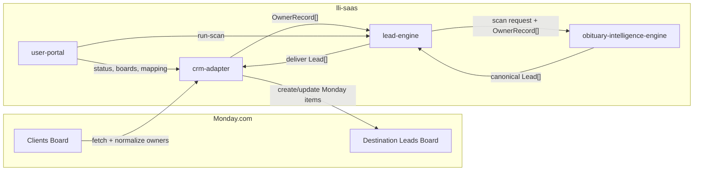
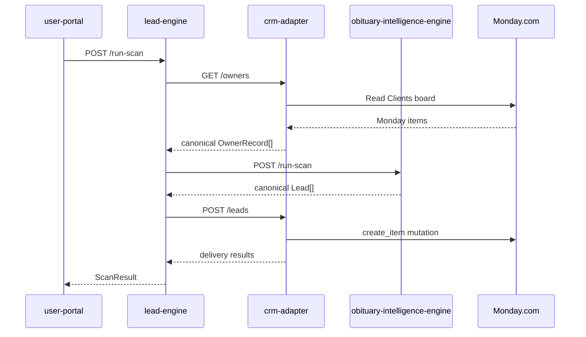
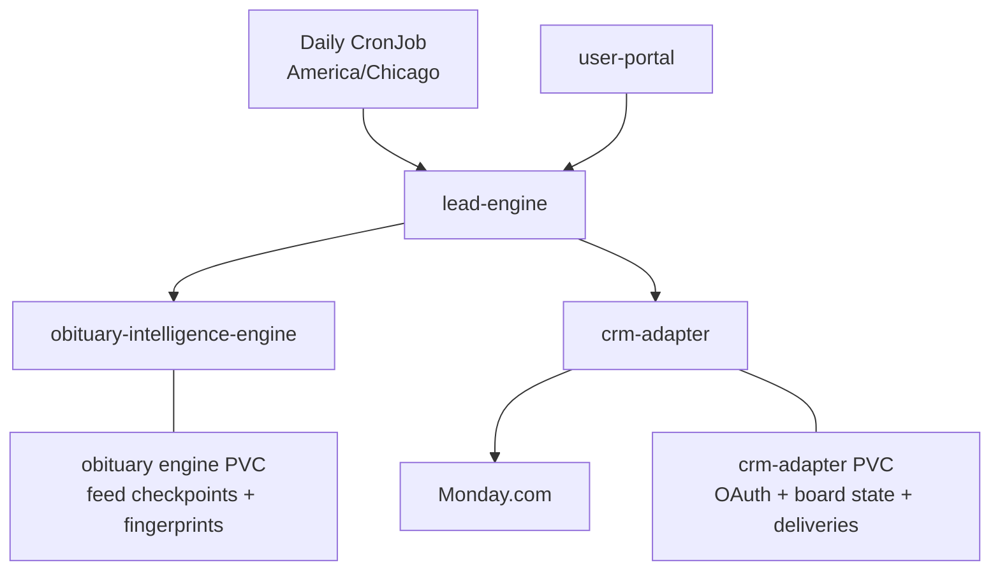

# lli-saas

`lli-saas` is an obituary-intelligence and CRM lead-delivery monorepo for land brokers.

The operating rule is simple:

- customer CRM is the source of truth for owner data
- `lli-saas` fetches owners at scan time
- `lli-saas` runs obituary intelligence against those canonical owners
- `lli-saas` delivers scored leads back into CRM
- `lli-saas` does not become a land database platform

Start with [docs/README.md](docs/README.md). The detailed architecture source of truth is [docs/system-architecture.md](docs/system-architecture.md).

## Current Stack

- `services/lead-engine` owns `run_scan()` orchestration
- `services/obituary-intelligence-engine` owns obituary collection, extraction, matching, and tiering
- `services/crm-adapter` owns Monday OAuth, owner normalization, board mapping, duplicate handling, and delivery
- `services/user-portal` is the operator UI for board selection, mapping, scan launch, and visibility
- `infra/` contains Kubernetes manifests, Helm templates, and the daily scan CronJob

## Architecture

## Canonical Contracts

- `OwnerRecord`
  - owner identity plus mixed-quality county, address, mailing, parcel, acreage, and operator fields
- `Lead`
  - owner/deceased identity, mixed-quality property data, heirs, obituary metadata, match metadata, tiering, notes, tags, and raw artifact references
- `ScanResult`
  - orchestration result, delivery summary, canonical leads, and structured errors

The schema artifacts live in [shared/contracts](shared/contracts).

## What Is Persisted

`lli-saas` does not persist the owner corpus or a full obituary warehouse.

It does persist:

- Monday OAuth/account state
- selected destination board metadata
- board mapping configuration
- delivery summaries and scan-run visibility
- obituary-engine feed checkpoints and processed-obituary fingerprints

## Quick Start

1. Install Node 20+, Python 3.11+, Docker, and kubectl.
2. Follow [docs/developer-onboarding.md](docs/developer-onboarding.md).
3. Run:
   - `cd services/lead-engine && poetry install && poetry run uvicorn src.app:app --reload --host 0.0.0.0 --port 8000`
   - `cd services/obituary-intelligence-engine && poetry install && poetry run uvicorn src.app:app --reload --host 0.0.0.0 --port 8080`
   - `cd services/crm-adapter && npm install && npm run dev`
   - `cd services/user-portal && npm install && npm run dev`
4. Run the pilot gate before a live rehearsal:
   - `bash scripts/pilot-readiness-check.sh`

## Repo Map

- [docs/README.md](docs/README.md) — documentation index
- [docs/system-architecture.md](docs/system-architecture.md) — architecture source of truth
- [docs/documentation-standards.md](docs/documentation-standards.md) — documentation maintenance rules
- [docs/developer-onboarding.md](docs/developer-onboarding.md) — local setup and service startup
- [docs/pilot-release-checklist.md](docs/pilot-release-checklist.md) — pre-pilot gate
- [docs/pilot-runbook-david-whitaker.md](docs/pilot-runbook-david-whitaker.md) — operator runbook
- [services/lead-engine/README.md](services/lead-engine/README.md) — orchestrator service doc
- [services/obituary-intelligence-engine/README.md](services/obituary-intelligence-engine/README.md) — obituary service doc
- [services/crm-adapter/README.md](services/crm-adapter/README.md) — Monday adapter doc
- [services/user-portal/README.md](services/user-portal/README.md) — operator UI doc
- [infra/README.md](infra/README.md) — deployment assets

## Legacy Material

Older Reaper-era documents are archived under [docs/archive/legacy/README.md](docs/archive/legacy/README.md). They are historical reference only and must not drive current implementation or release decisions.
