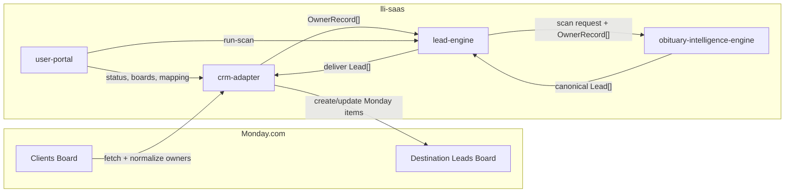
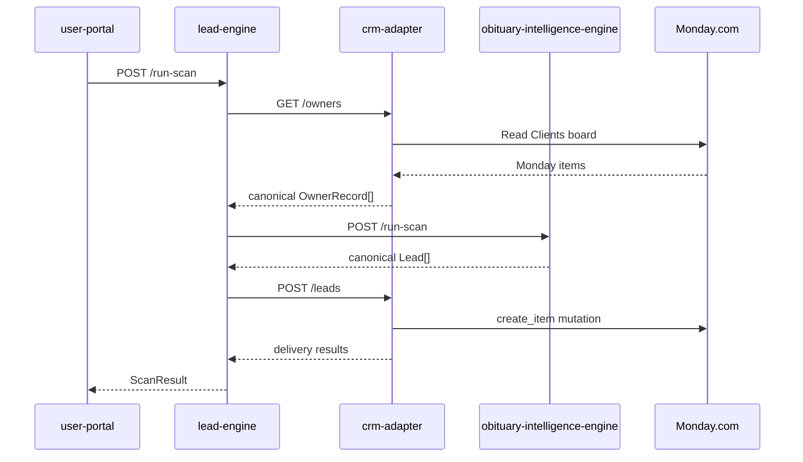
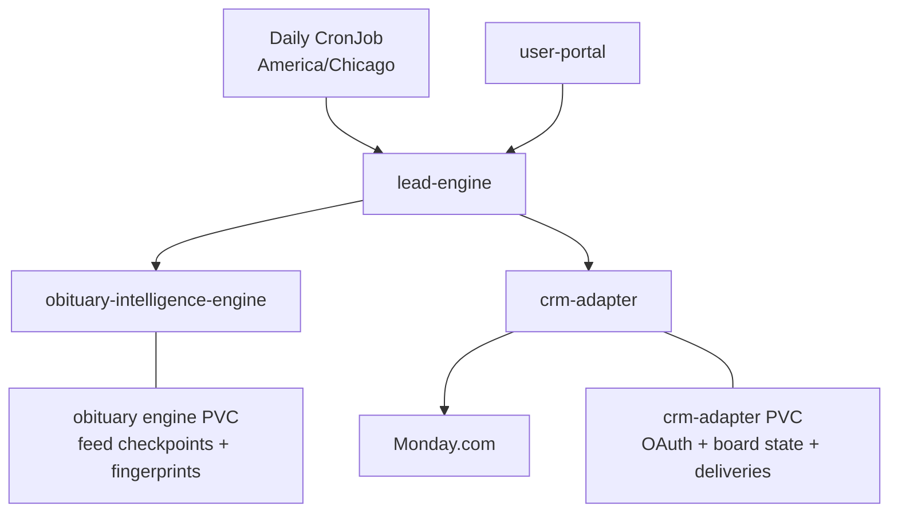

# lli-saas

`lli-saas` is an obituary-intelligence and CRM lead-delivery monorepo for land brokers.

The operating rule is simple:

- customer CRM is the source of truth for owner data
- `lli-saas` fetches owners at scan time
- `lli-saas` runs obituary intelligence against those canonical owners
- `lli-saas` delivers scored leads back into CRM
- `lli-saas` does not become a land database platform

Start with [docs/README.md](/Users/jordan/Desktop/LLI_v1/docs/README.md). The detailed architecture source of truth is [docs/system-architecture.md](/Users/jordan/Desktop/LLI_v1/docs/system-architecture.md). Repo-wide conventions live in [docs/engineering-standards.md](/Users/jordan/Desktop/LLI_v1/docs/engineering-standards.md).

## Where To Start

- new to the repo: read [docs/README.md](/Users/jordan/Desktop/LLI_v1/docs/README.md), then [docs/system-architecture.md](/Users/jordan/Desktop/LLI_v1/docs/system-architecture.md)
- getting a local stack running: follow [docs/developer-onboarding.md](/Users/jordan/Desktop/LLI_v1/docs/developer-onboarding.md) and [docs/credential-setup.md](/Users/jordan/Desktop/LLI_v1/docs/credential-setup.md)
- preparing or verifying the live pilot: use [docs/pilot-deploy-runbook.md](/Users/jordan/Desktop/LLI_v1/docs/pilot-deploy-runbook.md), [docs/pilot-release-checklist.md](/Users/jordan/Desktop/LLI_v1/docs/pilot-release-checklist.md), and [docs/pilot-runbook-david-whitaker.md](/Users/jordan/Desktop/LLI_v1/docs/pilot-runbook-david-whitaker.md)

## Current Stack

- `services/lead-engine` owns `run_scan()` orchestration
- `services/obituary-intelligence-engine` owns mixed-source obituary collection, extraction, matching, tiering, and source-health proofing
- `services/crm-adapter` owns Monday OAuth, owner normalization, board mapping, duplicate handling, and delivery
- `services/user-portal` is the operator UI for board selection, mapping, scan launch, and visibility
- `infra/` contains Kubernetes manifests, Helm templates, and the daily scan CronJob

## Architecture

## Current Pilot Status

- latest verified live rehearsal: March 12, 2026
- verified public portal: `http://portal.35.225.151.173.sslip.io`
- verified public `crm-adapter`: `http://crm.34.42.223.140.sslip.io`
- verified public `lead-engine`: `http://lead.34.57.110.0.sslip.io:8000`
- verified Monday OAuth callback: `http://crm.34.42.223.140.sslip.io/auth/callback`
- verified source owner board: `Clients` (`18403764833`)
- verified destination lead board: `lli-saas Pilot Leads` (`18403599732`)
- final successful dashboard-triggered scan: `0754b40d-6a1e-4b49-96e7-2d966c335e19`
- final verified Monday item: `Elaine Carter - Boone County` (`11497241942`)
- saved evidence: [artifacts/pilot-live/20260312T234637Z/final-audit-session-prompt.md](/Users/jordan/Desktop/LLI_v1/artifacts/pilot-live/20260312T234637Z/final-audit-session-prompt.md) and sibling files in that directory

## Canonical Contracts

- `OwnerRecord`
  - owner identity plus mixed-quality county, address, mailing, parcel, acreage, and operator fields
- `Lead`
  - owner/deceased identity, mixed-quality property data, heirs, obituary metadata, match metadata, tiering, notes, tags, and raw artifact references
- `ScanResult`
  - orchestration result, delivery summary, canonical leads, and structured errors

The schema artifacts live in [shared/contracts](/Users/jordan/Desktop/LLI_v1/shared/contracts).

## What Is Persisted

`lli-saas` does not persist the owner corpus or a full obituary warehouse.

It does persist:

- Monday OAuth/account state
- selected destination board metadata
- board mapping configuration
- delivery summaries and scan-run visibility
- obituary-engine feed checkpoints and processed-obituary fingerprints

## Quick Start

1. Install Node 20+, Python 3.11+, Docker, and kubectl.
2. Follow [docs/developer-onboarding.md](/Users/jordan/Desktop/LLI_v1/docs/developer-onboarding.md).
3. Audit local credentials and env:
   - `bash scripts/check-credentials.sh`
4. Bootstrap dependencies:
   - `make bootstrap`
5. Run static quality checks before opening a PR:
   - `make lint`
   - `make typecheck`
   - `make format-check`
6. Run:
   - `cd services/lead-engine && poetry run uvicorn src.app:app --reload --host 0.0.0.0 --port 8000`
   - `cd services/obituary-intelligence-engine && poetry run uvicorn src.app:app --reload --host 0.0.0.0 --port 8080`
   - `cd services/crm-adapter && npm run dev`
   - `cd services/user-portal && npm run dev`
7. Run the pilot gate before a live rehearsal:
   - `bash scripts/pilot-readiness-check.sh`
8. Validate obituary source health before claiming source coverage:
   - `python3 scripts/validate-obituary-sources.py --json-output /tmp/obituary-sources.json`

## Repo Layout

- `services/lead-engine/` orchestrates owner fetch, obituary scan execution, and delivery
- `services/obituary-intelligence-engine/` owns source collection, extraction, matching, tiering, and source-health proofing
- `services/crm-adapter/` owns Monday OAuth, operator session auth, owner normalization, mapping, and delivery state
- `services/user-portal/` is the operator UI for login, board selection, mapping, scan launch, and visibility
- `infra/` contains the Helm chart, reference manifests, and deployment support files
- `docs/` holds active architecture, onboarding, pilot, and standards documentation
- `shared/contracts/` holds canonical schema artifacts shared across services

## Documentation Map

- [docs/README.md](/Users/jordan/Desktop/LLI_v1/docs/README.md) — documentation index
- [docs/system-architecture.md](/Users/jordan/Desktop/LLI_v1/docs/system-architecture.md) — architecture source of truth
- [docs/documentation-standards.md](/Users/jordan/Desktop/LLI_v1/docs/documentation-standards.md) — documentation maintenance rules
- [docs/engineering-standards.md](/Users/jordan/Desktop/LLI_v1/docs/engineering-standards.md) — repo conventions, CI bar, and default tooling standards
- [docs/developer-onboarding.md](/Users/jordan/Desktop/LLI_v1/docs/developer-onboarding.md) — local setup and service startup
- [docs/credential-setup.md](/Users/jordan/Desktop/LLI_v1/docs/credential-setup.md) — credential and `.env` setup
- [docs/pilot-release-checklist.md](/Users/jordan/Desktop/LLI_v1/docs/pilot-release-checklist.md) — pre-pilot gate
- [docs/pilot-deploy-runbook.md](/Users/jordan/Desktop/LLI_v1/docs/pilot-deploy-runbook.md) — pilot deploy and rollback commands
- [docs/pilot-runbook-david-whitaker.md](/Users/jordan/Desktop/LLI_v1/docs/pilot-runbook-david-whitaker.md) — operator runbook
- [services/lead-engine/README.md](/Users/jordan/Desktop/LLI_v1/services/lead-engine/README.md) — orchestrator service doc
- [services/obituary-intelligence-engine/README.md](/Users/jordan/Desktop/LLI_v1/services/obituary-intelligence-engine/README.md) — obituary service doc
- [services/crm-adapter/README.md](/Users/jordan/Desktop/LLI_v1/services/crm-adapter/README.md) — Monday adapter doc
- [services/user-portal/README.md](/Users/jordan/Desktop/LLI_v1/services/user-portal/README.md) — operator UI doc
- [infra/README.md](/Users/jordan/Desktop/LLI_v1/infra/README.md) — deployment assets

## Legacy Material

Older Reaper-era documents are archived under [docs/archive/legacy/README.md](/Users/jordan/Desktop/LLI_v1/docs/archive/legacy/README.md). They are historical reference only and must not drive current implementation or release decisions.

Active engineering decisions live under [docs/adr](/Users/jordan/Desktop/LLI_v1/docs/adr/README.md). Root-level planning markdown outside this README should be treated as historical unless explicitly linked from the docs index.
