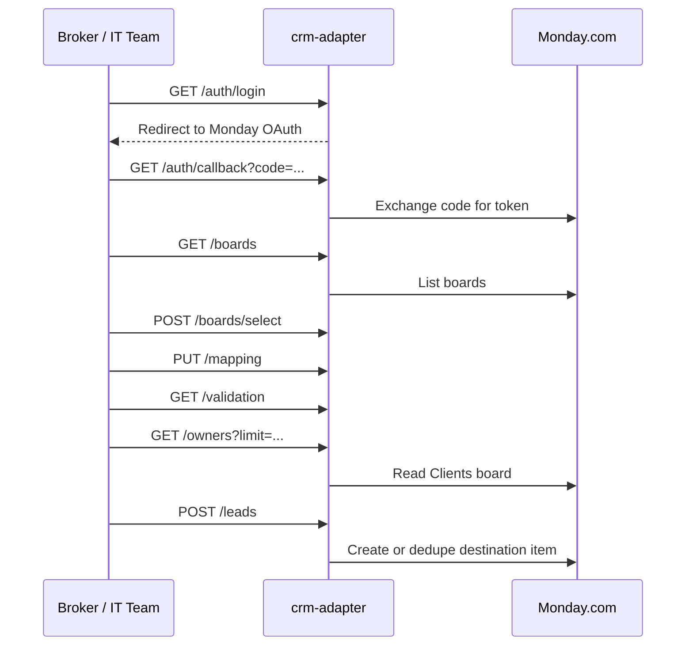

# LLI Data Intake API

This document formalizes the self-service integration surface exposed by `services/crm-adapter`.

## What this API is for

Technical brokers or their internal IT teams can use this API to:

1. connect an LLI tenant to Monday.com
2. inspect available boards
3. select a destination lead board
4. validate board readiness and mapping coverage
5. fetch normalized owner records from the source `Clients` board
6. submit canonical obituary lead payloads into the selected board

This keeps onboarding repeatable and reduces one-off support work.

## Source of truth

- Interactive OpenAPI portal: `services/crm-adapter/developer-portal.html`
- Machine-readable spec: `services/crm-adapter/openapi.json`
- Canonical lead JSON Schema: `shared/contracts/lead.schema.json`
- Canonical owner JSON Schema: `shared/contracts/owner-record.schema.json`
- Service implementation: `services/crm-adapter/src/app.js`

## Authentication and tenant scoping

### Monday authentication

`crm-adapter` uses Monday OAuth for upstream board access and downstream lead delivery.

- Start OAuth with `GET /auth/login`
- Finish OAuth with `GET /auth/callback?code=...`
- The adapter persists the Monday access token in its configured state store

### Tenant selection

Most endpoints accept an optional `x-tenant-id` header.

- If omitted, the adapter uses `pilot`
- Tenant state includes OAuth, selected destination board, mapping, scan runs, and delivery history

Example:

```http
x-tenant-id: david-whitaker
```

## Integration flow



## Endpoint summary

| Route | Purpose |
| --- | --- |
| `GET /health` | Liveness probe |
| `GET /ready` | Readiness probe for required environment configuration |
| `GET /contract` | Returns the filesystem paths of canonical JSON schemas |
| `GET /auth/login` | Start Monday OAuth |
| `GET /auth/callback` | Persist Monday OAuth token |
| `GET /boards` | List boards available to the tenant |
| `POST /boards/select` | Persist the destination board for lead delivery |
| `GET /mapping` | Inspect persisted board mapping |
| `PUT /mapping` | Save board mapping |
| `GET /validation` | Inspect current setup readiness |
| `POST /validation/preview` | Preview validation for an unsaved board/mapping |
| `GET /owners` | Fetch normalized owner records from `Clients` |
| `POST /leads` | Validate and deliver a canonical lead payload |
| `GET /deliveries` | Delivery history and scan runs |
| `GET /status` | Full tenant snapshot used by the portal |

## Canonical lead payload

`POST /leads` expects the canonical schema at `shared/contracts/lead.schema.json`.

### Required top-level fields

- `scan_id`
- `source`
- `run_started_at`
- `run_completed_at`
- `owner_id`
- `owner_name`
- `deceased_name`
- `property`
- `heirs`
- `obituary`
- `match`
- `tier`
- `out_of_state_heir_likely`
- `out_of_state_states`
- `executor_mentioned`
- `unexpected_death`
- `notes`
- `tags`
- `raw_artifacts`

### Field notes

- Date-times must be ISO 8601 with timezone offset, for example `2026-03-30T14:03:12Z`
- `obituary.death_date` must be an ISO date, for example `2026-03-29`
- `match.status` must be `auto_confirmed` or `pending_review`
- `tier` must be one of `hot`, `warm`, `pending_review`, or `low_signal`
- Arrays may be empty, but they must be present
- The runtime validator is strict: unknown top-level fields are rejected

### Example payload

See:

- `services/crm-adapter/examples/submit_lead.py`
- `services/crm-adapter/examples/submit_lead.mjs`
- `services/crm-adapter/openapi.json` example `LeadExample`

## Board mapping model

The destination board mapping payload uses this shape:

```json
{
  "item_name_strategy": "deceased_name_county",
  "columns": {
    "deceased_name": "text_mks9h0v9",
    "owner_name": "text_mks9m6j2",
    "obituary_url": "link_mks97f4h",
    "match_score": "numbers_mks9s8j0",
    "tier": "status_mks9v4x1"
  }
}
```

### Allowed `item_name_strategy` values

- `deceased_name_county`
- `deceased_name_only`
- `deceased_name_address`

### Allowed `columns` keys

- `deceased_name`
- `owner_name`
- `owner_id`
- `property_address`
- `county`
- `acres`
- `operator_name`
- `death_date`
- `obituary_source`
- `obituary_url`
- `match_score`
- `match_status`
- `tier`
- `heir_count`
- `heirs_formatted`
- `out_of_state_heir_likely`
- `out_of_state_states`
- `executor_mentioned`
- `unexpected_death`
- `tags`
- `scan_id`
- `source`

## Delivery and idempotency behavior

`POST /leads` is safe for retries.

The adapter:

1. validates the payload before any Monday writes
2. computes a deterministic `transaction_id`
3. skips already-successful retries as `skipped_idempotent_retry`
4. skips duplicates as `skipped_duplicate`
5. only creates a Monday item when no duplicate is found
6. persists delivery records and scan-run visibility for every attempt

This is the key onboarding guarantee for self-service integrations: clients can retry the same submission without creating duplicate lead records.

## Running the interactive docs

Open the generated portal locally in either of these ways:

### Option 1: open the static file directly

Open:

- `services/crm-adapter/developer-portal.html`

### Option 2: serve the folder over HTTP

```bash
cd services/crm-adapter
python3 -m http.server 4208
```

Then visit:

- `http://localhost:4208/developer-portal.html`

## Example submission

### Python

```bash
python3 services/crm-adapter/examples/submit_lead.py
```

### Node.js

```bash
node services/crm-adapter/examples/submit_lead.mjs
```

Both examples assume:

- `crm-adapter` is running on `http://localhost:3000`
- the tenant already completed Monday OAuth
- a destination board has already been selected

## Recommended onboarding handoff

For a technical broker onboarding flow, give them:

1. `docs/data-intake-api.md`
2. `services/crm-adapter/openapi.json`
3. `services/crm-adapter/developer-portal.html`
4. the Python and Node examples in `services/crm-adapter/examples/`

That package is enough for an IT team to understand the contract, validate required fields, and build an initial integration without custom support.
