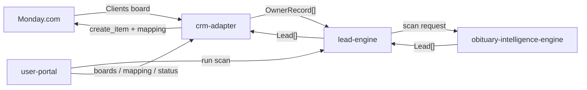
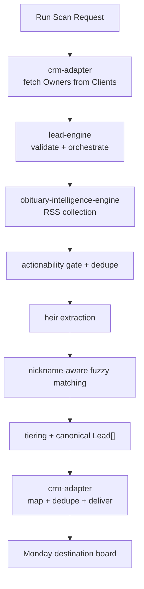
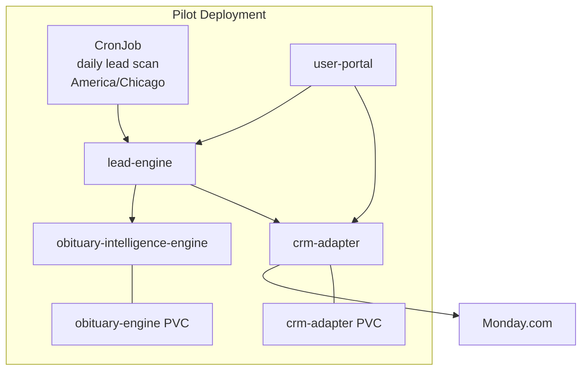

# System Architecture

This document is the architecture source of truth for `lli-saas`.

## System Purpose

`lli-saas` is an obituary-intelligence and CRM lead-delivery platform for land brokers.

- CRM is the source of truth for owner data.
- Owner data is fetched fresh at scan time.
- Obituary intelligence is a bounded service, not a CRM concern.
- The platform does not become a permanent owner or obituary warehouse.

## Core Runtime Flow

## Scan Pipeline

## Deployment Footprint

## Components

- `user-portal`
  - operator-facing UI for board selection, mapping edits, scan launch, and visibility
- `crm-adapter`
  - Monday-only adapter for operator session login, Monday OAuth, board discovery, owner normalization, delivery mapping, duplicate handling, and persisted delivery state
- `lead-engine`
  - the single orchestration owner for `run_scan()`
- `obituary-intelligence-engine`
  - owns RSS ingestion, obituary text extraction, actionability gating, heuristic/LLM heir extraction, nickname-aware matching, out-of-state detection, and lead tiering

## Canonical Models

- `OwnerRecord`
  - `owner_id`
  - `owner_name`
  - `county`
  - `state`
  - `acres`
  - `parcel_ids`
  - `mailing_state`
  - `mailing_city`
  - `mailing_postal_code`
  - `property_address_line_1`
  - `property_city`
  - `property_postal_code`
  - `operator_name`
  - `crm_source`
  - `raw_source_ref`

- `Lead`
  - scan metadata
  - owner and deceased identity
  - mixed-quality property details
  - heir records
  - obituary metadata
  - match metadata
  - `tier`
  - out-of-state and executor signals
  - notes, tags, raw artifact references

- `ScanResult`
  - `scan_id`
  - `status`
  - `owner_count`
  - `lead_count`
  - `delivery_summary`
  - `leads`
  - `errors`

## Persistence Boundaries

- Not persisted
  - owner corpus snapshots
  - full obituary corpus
  - permanent lead warehouse

- Persisted by `crm-adapter`
  - Monday OAuth/account state
  - selected board metadata
  - board mapping
  - deliveries
  - scan-run summaries

- Persisted by `obituary-intelligence-engine`
  - feed checkpoints
  - processed obituary fingerprints with retention pruning

## Design Rules

- CRM remains the owner-data source of truth.
- `lead-engine` remains the single orchestration entrypoint.
- `obituary-intelligence-engine` returns canonical leads directly.
- CRM-specific mapping logic stays in `crm-adapter`.
- Operator-specific workflow stays in `user-portal`.
- Future CRM support should require new adapter mappings, not obituary-core rewrites.
- Only `/health` and `/ready` are public service routes. All other service traffic uses signed JWT bearer auth with `tenant_id` derived from verified claims, not request headers.
